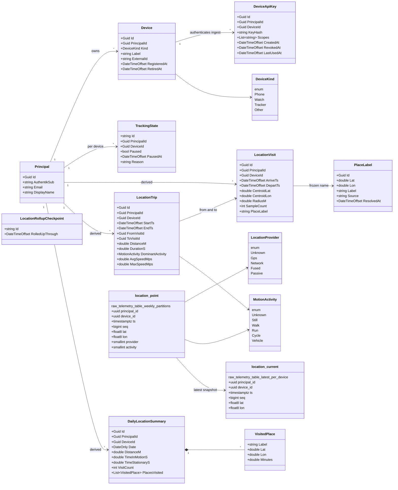

# Architecture

LupiraLocationApi is a single-owner location/presence service: it ingests high-volume GPS telemetry from
registered devices and serves the owner's track, derived movement intelligence, and coarse place labels.
This document describes the design as it is in the code — what the bounded context owns, how identity and
ownership work, how telemetry flows in and is rolled up, and how outcomes map to the wire.

## Bounded context & layering

The solution is two projects, and the split is the architectural boundary:

- **`LupiraLocationApi.Core`** — the bounded context. Domain types, transport-neutral application services,
  DTOs, and mappers. It has **no ASP.NET dependency** (only Marten/Npgsql flow in), so the domain can never
  reach for HTTP concerns. This is enforced by the compiler via the project reference direction.
- **`LupiraLocationApi`** — a thin ASP.NET host. Minimal-API endpoint groups delegate to handlers, which
  call Core services and map results to the wire. Auth schemes, health checks, OpenAPI/Scalar wiring, and
  the background maintenance service live here.

```
HTTP ─▶ Endpoints/ ─▶ Handlers/ ─▶ Core: Application services ─▶ Marten (location) + Npgsql (telemetry)
  │                       │                     │
  └─ MCP ─▶ Mcp/ tools ───┘                  OpResult  ──▶  Http/ (RFC 7807) on the way back
                       Auth/ (CurrentUser)
```

A second thin transport adapter, **`Mcp/`** ([LocationTools.cs](../src/LupiraLocationApi/Mcp/LocationTools.cs)),
exposes the bounded context to an LLM agent over MCP (Streamable HTTP, `ModelContextProtocol.AspNetCore`).
Its tools call the **same Core services** as the handlers — no second source of truth — and resolve identity
through the same `CurrentUser`, so every call is scoped to the caller's principal. The surface is deliberately
**read-only and derived/coarse**: it offers visits, trips, daily summaries, coarse place-at, and movement
stats, but no raw-track tools and no mutations. It is gated by `ApiPolicy` and meant to stay LAN/WireGuard-only
— [Endpoints/McpExposure.cs](../src/LupiraLocationApi/Endpoints/McpExposure.cs) 404s any `/api/mcp` request
carrying reverse-proxy edge headers as a defence-in-depth backstop.

Composition: [Program.cs](../src/LupiraLocationApi/Program.cs) registers the context via
`AddLocationCore()` ([CoreServiceCollectionExtensions.cs](../src/LupiraLocationApi.Core/CoreServiceCollectionExtensions.cs)),
which configures the Marten store, a shared `NpgsqlDataSource` for the raw path, and the services.

## Two storage models, one database

The context deliberately uses **two storage models in a single Postgres database**, in two schemas that
never overlap:

- **`location` (Marten documents).** Discrete, low-frequency, mutable state: the `Principal` identity, the
  registered `Device`s and their `DeviceApiKey`s, the per-device `TrackingState`, and the *derived*
  intelligence (`LocationVisit`, `LocationTrip`, `DailyLocationSummary`, `PlaceLabel` cache, and the
  `LocationRollupCheckpoint`). Configured in
  [MartenRegistrations.cs](../src/LupiraLocationApi.Core/MartenRegistrations.cs); Marten runs as a **plain
  document store** (`UseLightweightSessions`) — there is **no event sourcing** here.
- **`telemetry` (raw partitioned tables).** The high-frequency append-only GPS stream:
  `telemetry.location_point` (the full fix history, **range-partitioned weekly**) and
  `telemetry.location_current` (one latest-snapshot row per device). Written and read with raw Npgsql; DDL
  in [TelemetrySchema.cs](../src/LupiraLocationApi.Core/Telemetry/TelemetrySchema.cs).

**Why time-series is not event-sourced.** GPS fixes are append-only, never edited, and bulk-expired by
date. Event sourcing buys nothing for that shape and would make retention-drop awkward. Purpose-built
partitioned relational tables give cheap range scans and `DROP PARTITION` retention instead. Marten's
schema-diff only inspects the `location` schema, so it never touches `telemetry`. The single
`--apply-schema` step applies Marten's schema *and* `TelemetrySchema.ApplyAsync`.

## Identity & ownership

Identity is **just-in-time provisioned** and local to this service:

- A `Principal` is resolved from the caller's OIDC claims by `sub` first, then email, and created on first
  sight ([PrincipalDirectory.cs](../src/LupiraLocationApi.Core/Application/PrincipalDirectory.cs)). The host's
  `CurrentUser` ([Auth/CurrentUser.cs](../src/LupiraLocationApi/Auth/CurrentUser.cs)) reads the claims; the
  directory never sees the request. `AuthentikSub` holds the OIDC `sub` (the name is historical — any OIDC
  issuer works); email is a mutable lookup attribute. There is no shared user table — the `sub` is the only
  cross-service join key.
- **Single-owner devices.** A `Device` is owned directly by the `Principal` that registered it
  ([DeviceService.cs](../src/LupiraLocationApi.Core/Application/DeviceService.cs)). There is no sharing model;
  ownership is the only authorization gate, and every query is scoped to the calling principal's own data.

### Two auth policies

[Program.cs](../src/LupiraLocationApi/Program.cs) defines two policies over distinct schemes:

- **`ApiPolicy`** — OIDC JWT bearer (resource-server validation against `Auth__Authority`/`Auth__Audience`).
  In Development a `DevAuthHandler` adds an `X-Dev-User: email` header scheme so the API can be exercised
  without an OIDC provider; it is registered **only** in Development.
- **`IngestPolicy`** — a per-device API key
  ([DeviceKeyAuthHandler.cs](../src/LupiraLocationApi/Auth/DeviceKeyAuthHandler.cs)). The wire credential is
  `Authorization: DeviceKey {keyId}.{secret}`. Registration mints a 256-bit secret, returns it **once**, and
  stores only its SHA-256 hash ([DeviceKeyHashing.cs](../src/LupiraLocationApi.Core/Domain/DeviceKeyHashing.cs));
  verification is constant-time. The handler resolves the `(principal, device)` the key acts for and stamps
  those ids as claims — **the ingest path takes principal/device from the key, never from the payload**, and
  a body that carries ids is rejected. Retiring a device revokes its keys.

## Ingest pipeline

`POST /api/ingest/location` accepts NDJSON (one fix per line). The flow in
[LocationIngestService.cs](../src/LupiraLocationApi.Core/Application/Telemetry/LocationIngestService.cs):

1. **Pause check** — if `TrackingState` for `(principal, device)` is paused, the batch is accepted (`202`)
   but discarded; the receipt's `Paused` flag tells the uploader to stop collecting.
2. **Parse & validate** per line — reject body-supplied ids, missing/invalid `seq`, out-of-range timestamps
   (>5 min future or older than retention), and invalid lat/lon. Bad rows become permanent `rejects`; the
   batch is capped at 10,000 rows.
3. **Partition on demand** — for every distinct week present in the batch, ensure the weekly partition exists
   ([PartitionManager.cs](../src/LupiraLocationApi.Core/Telemetry/PartitionManager.cs)). There is no DEFAULT
   partition, so a late/backfilled fix always gets a real home.
4. **Idempotent merge** — insert via a single `unnest(...)` array statement with `ON CONFLICT DO NOTHING`
   keyed on `(principal_id, device_id, ts, seq)`, so retries and overlapping batches are free.
5. **Monotonic snapshot** — upsert `location_current`, advancing only when the incoming `seq` is greater.
6. **Receipt** — return counts (`submitted` / `inserted` / `duplicates` / `rejected`), the per-row rejects,
   and the high-water `seq`. `GET …/cursor` returns that high-water mark so a disconnected uploader can
   resume exactly where it left off.

## Derived intelligence & maintenance

A background `LocationMaintenanceService`
([Background/LocationMaintenanceService.cs](../src/LupiraLocationApi/Background/LocationMaintenanceService.cs))
runs hourly (gated by `Telemetry__MaintenanceEnabled`, disabled under test):

1. Pre-provision partitions for the active/upcoming window.
2. For each `(principal, device)` seen in `location_current`, roll up *yesterday* and *today*.
3. Drop raw partitions entirely older than `Telemetry__LocationRetentionDays`.

The rollup ([TripVisitService.cs](../src/LupiraLocationApi.Core/Application/Telemetry/TripVisitService.cs))
reads a day's accurate fixes (≤50 m accuracy, non-mock) and derives:

- **Visits** — stay-points via clustering: a visit opens while consecutive fixes stay within an ~80 m roam
  radius for at least 8 minutes of dwell; the centroid, radius, and sample count are recorded.
- **Trips** — the movement between consecutive visits: path distance, duration, dominant OS-reported motion
  activity, and average/max speed.
- **DailyLocationSummary** — per-day distance, time in motion vs stationary, visit count, and the places
  visited with dwell minutes.

The rollup is **idempotent** — re-running a day replaces that day+device's documents (the summary uses a
deterministic id from `(principal, device, date)`). Because Visits/Trips/Summaries are Marten documents in
the `location` schema, they **survive raw-fix retention drop**.

**Place labels** ([PlaceLabelService.cs](../src/LupiraLocationApi.Core/Application/Telemetry/PlaceLabelService.cs))
are resolve-once-and-freeze: a coordinate is quantized to a ~100 m grid cell (stable deterministic id) and
reverse-geocoded against a Nominatim instance if `Nominatim__BaseUrl` is set. The result is cached as a
`PlaceLabel` document and frozen onto visits. If unset, or on any failure, the label is simply `null` — it
never blocks ingest and never calls out unless configured. `GET /api/location/at` returns only a coarse
label + coarsened coordinate, never the raw fix.

## Error handling & transport mapping

Services return a transport-neutral [`OpResult` / `OpResult<T>`](../src/LupiraLocationApi.Core/Application/OpResult.cs)
with an `OpStatus` of `Ok` / `NotFound` / `Forbidden` / `Invalid` / `Conflict`. Expected outcomes are
**values, not exceptions**.

The host maps them to typed ASP.NET `Results<...>` unions in
[Http/OpResultMapping.cs](../src/LupiraLocationApi/Http/OpResultMapping.cs), emitting RFC 7807
`application/problem+json` for failures via [Http/Problems.cs](../src/LupiraLocationApi/Http/Problems.cs)
(`400`/`403`/`409`). A status a given result shape cannot represent is a programming error and throws.
Read-only query endpoints are always `Ok` (scoped to the caller) and return their payload directly. The
JSON contract emits enums as their string names (`JsonStringEnumConverter`).

## Domain model

All types below are Marten documents in the `location` schema **except** `location_point` and
`location_current`, which are raw range-partitioned tables in the `telemetry` schema (shown with their SQL
column types). Derived documents reference `Principal`/`Device` **by id (Guid), not by foreign key**; the
raw tables likewise stamp `principal_id`/`device_id` by value.



> The `enum` / `raw_telemetry_table_*` lines are pseudo-stereotypes: the first three value-lists are
> enums (`DeviceKind`, `LocationProvider`, `MotionActivity`), and `location_point` / `location_current`
> are the raw `telemetry`-schema tables, not Marten documents.
